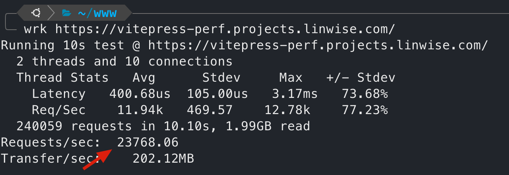

# Simple Vitepress Performance Test

> Vitepress 2 from https://vitepress.dev/
>
> App running on 4c8g 20hdd AWS EC2 VPS.
>
> Requests are sent from the same server.

## Screenshots

### get landing page 23000+ qps

## License

Vitepress is MIT licensed
